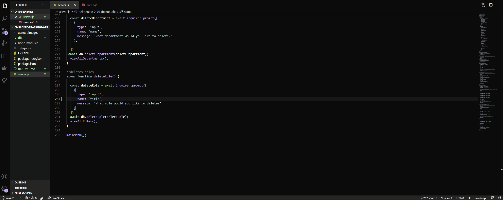

# employee-tracking-app
This app manages a company's department, roles, & employees using node, inquirer, and MySQL.

## Table of contents
- [General Info](#general-info)
- [Installation](#installation)
- [Usage](#usage)
- [Link to GitHub Repo](#link-to-github-repo)
- [Demo](#demo)
- [Technologies](#technologies)
- [Summary](#summary)
- [Author](#author)

## General Info
-This application meets the following criteria:

```
As a business owner
I want to be able to view and manage the departments, roles, and employees in my company
So that I can organize and plan my business
```

## Installation
```md
Open file in integrated terminal
node server 
You will need to install all dependencies
npm i
You will also need to import the schema.sql & seed.sql into mySQL Workbench


```
## Usage
To run this app enter the following into an integrated terminal:
```
node server
```

## Link to GitHub Repo
https://github.com/joshrehanek/employee-tracking-app

## Demo
- 

## Technologies
- [node.js](https://nodejs.org/en//)
- [npm](https://www.npmjs.com/)
- [inquirer](https://www.npmjs.com/package/inquirer)
- [mySQL](https://www.mysql.com/)


## Summary
- This app manages a company's department, roles, & employees using node, inquirer, and MySQL.

## Author
- Joshua Azzam Rehanek